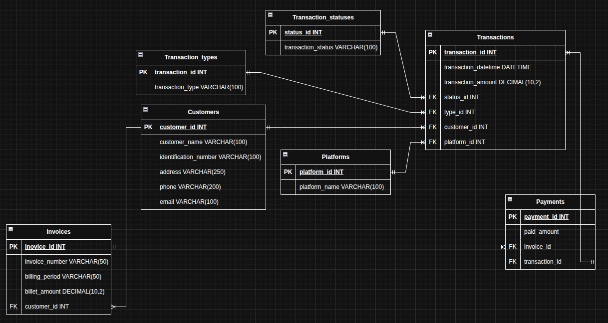

# Final_BD

---

# Database Management System

## System Description
This system allows you to manage data stored in a MySQL database. It includes features for bulk loading data from CSV files, running advanced queries, and organizing information using normalization principles. It is developed in Node.js with a connection to MySQL and uses libraries that facilitate file reading and data manipulation.

---

## Instructions for running the project

### 1- Installing dependencies
Make sure you have **Node.js** and **MySQL** installed on your system. Then, in the project folder, run:

```bash
npm install mysql2 csv-parser express cors multer dotenv
```

### 2- Database Configuration
1. Create a database in MySQL.
2. Import the SQL script with the structure and initial data.
3. Configure the connection credentials in a .env file:
```env
DB_HOST=localhost
DB_USER=root
DB_PASSWORD=Qwe.123*
DB_NAME=pd_Jose_Cortes_Berners_lee
PORT=3000
```

### 3- Execute the server
```bash
node app.js
```

### 4- Execute the file to import CSV
```bash
node insert_csv.js
```

---

## Technologies Used
- **MySQL** – Relational database engine.
- **Node.js** – JavaScript runtime environment.
- **MySQL2** – Library for connecting Node.js to MySQL.
- **CSV-Parser** – Library for reading CSV files.
- **Express** – Framework for creating APIs and managing routes.
- **CORS** – Middleware for enabling cross-domain requests.
- **Multer** – Middleware for file uploads.
- **Dotenv** – Environment variable management.

---

## Normalization Explanation
The database was designed following the principles of **normalization** up to **Third Normal Form (3NF)** to:
- Eliminate redundant data.
- Ensure referential integrity.
- Improve query efficiency.

**Normalization Applied:**
1. **1NF:** Duplicate groups were eliminated and each field was guaranteed to have an atomic value.
2. **2NF:** Tables were separated so that each attribute was completely dependent on the primary key.
3. **3NF:** Transitive dependencies were eliminated to optimize relationships.

---

## Instructions for bulk uploading from CSV
1. Place the .csv file in the uploads folder of your project.
2. Submit the file using the upload endpoint using Multer.
3. The system will process the CSV with csv-parser and insert the data into the MySQL database.

The system allows bulk uploads from a .csv file.

Example in insert_csv.js:
```javascript
import fs from 'fs';
import csv from 'csv-parser';
import { conectarDB } from './db/db.js';

const archivoCSV = './uploads/payments.csv';

async function insertarCSV() {
  const connection = await conectarDB();
  console.log('Conectado a la base de datos');

  fs.createReadStream(archivoCSV)
    .pipe(csv()) 
    .on('data', async (fila) => {
      try {
        const { paid_amount,invoice_id,transaction_id } = fila;

        const query = ('INSERT INTO payments ( paid_amount,invoice_id,transaction_id ) VALUES (?, ?, ?)')

        const [rows] = await connection.execute(query, [ paid_amount,invoice_id,transaction_id ]);

        console.log(`Insertado: ${paid_amount}`);
      } catch (err) {
        console.error('Error insertando fila:', err);
      }
    })
    .on('end', () => {
      console.log('Inserción completa desde CSV');
      connection.end();
    });
}

insertarCSV();

```

---

## Explanation of advanced queries
The system includes queries that allow you to:
- Total paid by each customer = we connect to the database, then call the name from the customenrs table, add the transaction amount, and connect the customers and transactions tables to obtain the total amount for each customer.
``` javascript
router.get('/', async (req, res) => {
    try {
        const connection = await conectarDB();
        const [rows] = await connection.execute(`SELECT 
            c.customer_name,
            SUM(t.transaction_amount) AS total_paid
            FROM customers c
            JOIN transactions t ON c.customer_id = t.customer_id
            GROUP BY c.customer_name
            ORDER BY total_paid DESC;`);
        await connection.end();
        res.json(rows);
    } catch (error) {
        console.error('Error del servidor', error);
        res.status(500).json({ mensaje: 'Error del servidor'});
    }
});

```

- Pending invoices with customer information and associated transaction = we connect to the database then we call the name from the customers table, the number from the invoices table and the status from the transactions table. We connect the three tables through the FK and we say to bring the statuses from the transaction_statuses table and thus we obtain the invoices with the customer and pending status.
``` javascript
router.get('/', async (req, res) => {
    try {
        const connection = await conectarDB();
        const [rows] = await connection.execute(`SELECT 
            i.invoice_number,
            c.customer_name,
            ts.transaction_status
            FROM invoices i
            JOIN customers c ON i.customer_id = c.customer_id
            JOIN transactions t ON c.customer_id = t.customer_id
            JOIN transaction_statuses ts ON t.status_id = ts.status_id
            WHERE ts.transaction_status = "Pendiente"
            GROUP BY i.invoice_number, c.customer_name, ts.transaction_status
            ORDER BY ts.transaction_status DESC;`);
        await connection.end();
        res.json(rows);
    } catch (error) {
        console.error('Error del servidor', error);
        res.status(500).json({ mensaje: 'Error del servidor'});
    }
});

```

- List of transactions by platform = we connect to the database then call the name of the platforms table, we perform a COUNT to count how many transactions there are for each of the platforms that exist and thus we obtain the count of how many transactions there are with each platform.
``` javascript
router.get('/', async (req, res) => {
    try {
        const connection = await conectarDB();
        const [rows] = await connection.execute(`SELECT 
            p.platform_name,
            COUNT(*) AS transactions_number
            FROM platforms p
            JOIN transactions t ON p.platform_id = t.platform_id
            GROUP BY p.platform_name
            ORDER BY transactions_number DESC;`);
        await connection.end();
        res.json(rows);
    } catch (error) {
        console.error('Error del servidor', error);
        res.status(500).json({ mensaje: 'Error del servidor'});
    }
});

```

- Perform aggregations (SUM, COUNT).
- **JOIN** queries between multiple tables to combine information.
- MySQL subqueries and functions for advanced analysis.

---

## Capturing the relational model


---

## Developer Information
- **Name:** [Jose Miguel Cortes Escobar]
- **Clan:** [Berners lee]
- **Email:** [j.c.e555@hotmail.com]